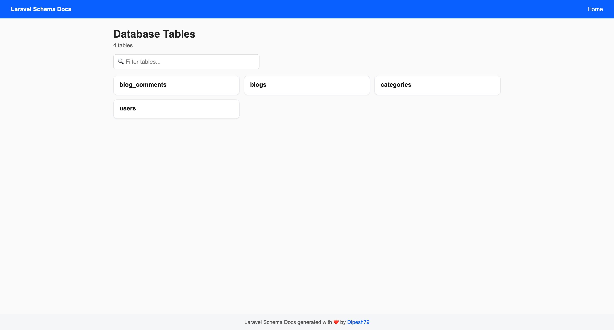
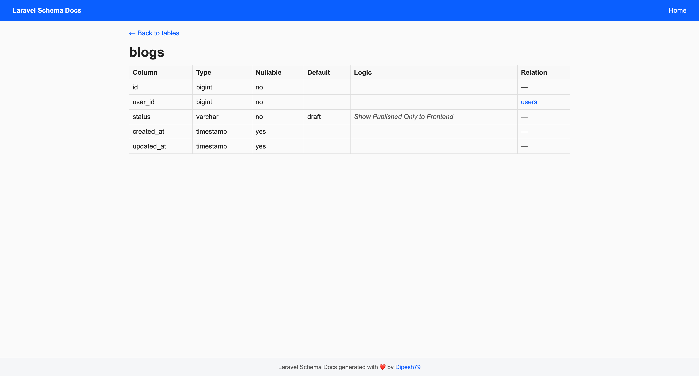

# Laravel Schema Docs

[](https://packagist.org/packages/dipesh79/laravel-schema-docs)
[](https://packagist.org/packages/dipesh79/laravel-schema-docs)
[](https://packagist.org/packages/dipesh79/laravel-schema-docs)

This Laravel package allows you to automatically generate Laravel database documentation and explore your schema with an interactive dashboard. Export your schema to YAML for easy reference and integration.

## Quick Start

### Install Using Composer

```
composer require dipesh79/laravel-schema-docs
```
## Official Documentation

Documentation can be found on my [website](https://khanaldipesh.com.np/package/laravel-schema-docs).

## Demo
### Dashboard


### Single DB Table View



## License

[MIT](https://choosealicense.com/licenses/mit/)

## Author

- [@Dipesh79](https://www.github.com/Dipesh79)

## Support

For support, email dipeshkhanal79[at]gmail[dot]com.
